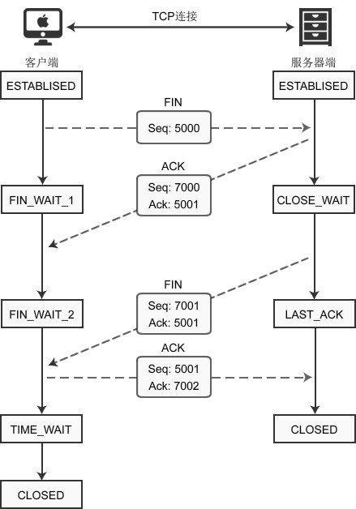

# 图解TCP四次握手断开连接

建立连接非常重要，它是数据正确传输的前提；断开连接同样重要，它让计算机释放不再使用的资源。如果连接不能正常断开，不仅会造成数据传输错误，还会导致套接字不能关闭，持续占用资源，如果并发量高，服务器压力堪忧。

建立连接需要三次握手，断开连接需要四次握手，可以形象的比喻为下面的对话：

- [Shake 1] 套接字A：“任务处理完毕，我希望断开连接。”
- [Shake 2] 套接字B：“哦，是吗？请稍等，我准备一下。”
- 等待片刻后……
- [Shake 3] 套接字B：“我准备好了，可以断开连接了。”
- [Shake 4] 套接字A：“好的，谢谢合作。”

下图演示了客户端主动断开连接的场景：

建立连接后，客户端和服务器都处于`ESTABLISED`状态。这时，客户端发起断开连接的请求：

1. 客户端调用 close() 函数后，向服务器发送 FIN 数据包，进入`FIN_WAIT_1`状态。FIN 是 Finish 的缩写，表示完成任务需要断开连接。
2. 服务器收到数据包后，检测到设置了 FIN 标志位，知道要断开连接，于是向客户端发送“确认包”，进入`CLOSE_WAIT`状态。
   - **注意：服务器收到请求后并不是立即断开连接，而是先向客户端发送“确认包”，告诉它我知道了，我需要准备一下才能断开连接。**
3. 客户端收到“确认包”后进入`FIN_WAIT_2`状态，等待服务器准备完毕后再次发送数据包。
4. 等待片刻后，服务器准备完毕，可以断开连接，于是再主动向客户端发送 FIN 包，告诉它我准备好了，断开连接吧。然后进入`LAST_ACK`状态。
5. 客户端收到服务器的 FIN 包后，再向服务器发送 ACK 包，告诉它你断开连接吧。然后进入`TIME_WAIT`状态。
6. 服务器收到客户端的 ACK 包后，就断开连接，关闭套接字，进入`CLOSED`状态。

## 关于 TIME_WAIT 状态的说明

**客户端最后一次发送 ACK包后进入 TIME_WAIT 状态，而不是直接进入 CLOSED 状态关闭连接，这是为什么呢？**

TCP 是面向连接的传输方式，必须保证数据能够正确到达目标机器，不能丢失或出错，而网络是不稳定的，随时可能会毁坏数据，所以机器A每次向机器B发送数据包后，都要求机器B”确认“，回传ACK包，告诉机器A我收到了，这样机器A才能知道数据传送成功了。如果机器B没有回传ACK包，机器A会重新发送，直到机器B回传ACK包。

客户端最后一次向服务器回传ACK包时，有可能会因为网络问题导致服务器收不到，服务器会再次发送 FIN 
包，如果这时客户端完全关闭了连接，那么服务器无论如何也收不到ACK包了，所以客户端需要等待片刻、确认对方收到ACK包后才能进入CLOSED状态。那么，要等待多久呢？

数据包在网络中是有生存时间的，超过这个时间还未到达目标主机就会被丢弃，并通知源主机。这称为报文最大生存时间（MSL，Maximum Segment Lifetime）。TIME_WAIT要等待 2MSL 才会进入 CLOSED 状态。ACK 包到达服务器需要 MSL 时间，服务器重传 FIN 包也需要 MSL 时间，2MSL 是数据包往返的最大时间，如果 2MSL 后还未收到服务器重传的 FIN 包，就说明服务器已经收到了 ACK 包。