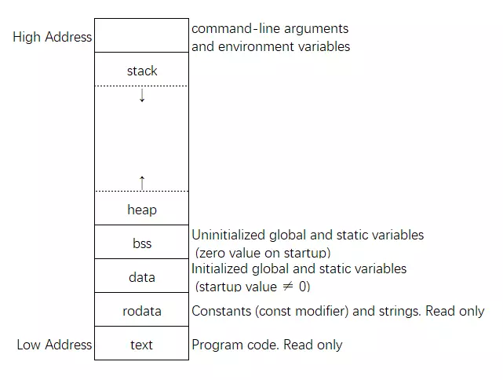

# [阿里中间件C++，LIANG](https://www.nowcoder.com/discuss/182300 )

## 一面

### 1. 几百G的日志文件，存放访问过的IP地址，找访问量topk，如何快速查找某个ip是否访问过（是否包含某个ip） ？

**第一问解法：**

这个应该不算简单的TopK问题了，参考解法[海量日志数据，提取出某日访问百度次数最多的那个IP ](https://github.com/yoghurtjia/-python-BAT-/blob/master/most_common_ip.py )。

1. 对于海量数据中的每一个ip，通过`hash()`函数计算`hash(ip) % 1000` ，存到1000个文件中，这样做的目的是让相同的ip都存到同一个文件中；
2. 可以得到每个文件的平均大小都会小于1G，这样就能加载到内存中；
3. 分别对于每个小文件，建立一个ip为key，访问次数为value的map，通过最小堆查找topK的思路，找出每个文件中访问量topK的ip，并记录下每个ip的访问量，这里可以建立结构体数组来实现；
4. 再将所有文件的前十的ip合并，再利用最小堆查找TopK的思路，找出topK。

解法仍然存在一个问题，就是如果单个ip的访问量很大，就会造成单个文件的大小太大。

**第二问解法：**

ip地址总共的数目其实也就2^32个，可以用512M的内存，一个bit位代表一个unsigned int值。在第一问的基础上读入文件中的ip，设置相应的bit位。然后读入查询的ip，查看相应的位是不是1，是1则表示访问过，否则0没访问过。

**[最小堆的实现](code/最小堆.cpp)**

### 2.C++多态

多态就是同一个接口，使用不同的实例具有不同的表现和行为。

#### 静多态

- 编译时发生的多态：重载和泛型编程（模板）；

#### 动多态

- 运行时发生的多态：虚函数实现；

### 3.vector和list中，clear()函数的区别

#### list::clear()

- 清除所有的变量，同时调用该变量的析构函数进行清理，并释放空间。

#### vector::clear()

- 清除变量，将size置为0，但是capacity不变，不回收内存。

### 4.epoll原理

epoll会维护在eventpoll结构体中的一棵红黑树和一个双向链表，来实现快速响应。

- epoll_create()函数会创建一个eventpoll结构体，其中有一棵红黑树和双向链表；
- epoll_ctl(ADD)会将新注册的事件挂载到红黑树的新结点上，并注册回调到硬件设备驱动程序上，如果驱动程序检测到事件响应就会调用回调，将活跃的事件添加到双向链表中；
- epoll_wait()函数会检查双向链表上活跃事件的个数，并把活跃事件填充到传入的数组中，并返回活跃事件个数。

### 5.volatile关键字 

让编译器每次操作该变量时一定要从内存中真正取出，而不是使用已经存在寄存器中的值，告诉编译器这个变量不可优化。

1. 一个参数既可以是const还可以是volatile吗？为什么？  

   可以。比如只读的状态寄存器，如果是volatile表示可能会意想不到地被改变，但是const让程序不能修改它。

2. 一个指针可以是volatile吗？

   可以。只是表示这个指针的指向是易变的。

### 6.找到两个链表的第一个公共节点，多种方法 

1. 笨方法

   遍历第一个链表的每个结点，对然后遍历第二个链表，一个一个比较得出公共结点。

2. 可行方法1

   利用两个vector，分别遍历两个链表，将地址或者键值顺序储存到数组中，然后从两个数组的最后一个结点开始往前遍历，如果相等就是公共结点，如果下一个不相等就是第一个公共结点。

3. 可行方法2

   首先分别遍历链表1和2，记录下二者长度差为k，然后利用两个指针遍历两个链表，先遍历长链表，当长链表指针走了k步时，短链表指针才开始走，碰到第一个相等的公共结点就是解。

### 7.debug和release的区别 

- debug通常是调试版本，包含调试信息，并且编译器不做任何优化；
- release是发布版本，进行了各种优化，使程序在代码大小和运行速度上都是最优的，方便用户使用。

### 8.构造函数成员初始化列表，与函数体有什么区别 

- 构造函数中对成员变量执行的叫赋值，而初始化列表对成员变量赋值的行为叫初始化；
- 初始化一定会在赋值之前执行；
- 初始化的顺序由成员变量的声明顺序决定，而构造函数赋值由函数体中赋值语句顺序决定；
- 性能上由于初始化列表只执行初始化，会比函数体内初始化+赋值的效率要高；
- 当成员变量中存在常量和引用变量时，只能使用初始化列表；
- 当成员变量是类或者结构体，且构造函数只有有参构造函数时，只能用初始化列表；
- 初始化列表中，基类的成员变量先初始化，静态或全部变量先初始化；

### 9.指针和引用的区别 

- 指针是实体，而引用仅仅是别名；
- 指针占用空间，引用不占用内存空间；
- 指针可改变指向，即可修改自己的内容，而引用初始化后不能再改变；
- 指针可为空，引用不能为空；
- 指针有const类型，但是引用没有；
- sizeof 指针 是指针的大小，sizeof 引用 是指向变量的大小；
- 自增运算符的意义和作用不一样；
- 引用时类型安全的，而指针不是，引用多了类型检查；

### 10.自己有什么优势？

因为不是科班出身，所以觉得自己没什么优势，但我觉得这个没有优势可能就是我最大的优势。

## 二面

### 1.static关键字，在什么时候初始化的？

参考[static静态局部变量初始化问题](https://www.cnblogs.com/novice-dxx/p/7094690.html)

- 简单类型在编译期间完成初始化；
- 复杂类型，比如类、结构体等在运行时才初始化；
- static修饰的变量只能被初始化一次；

### 2.C++11特性

1. 关键字
   - auto关键字
   - nullptr
   - for(Type it : STH)循环
2. STL容器
   - std::array
   - std::unordered_map
   - std::unordered_set
3. 多线程
   - std::thread
   - std::mutex
   - std::condition_variable
4. 智能指针
   - std::shared_ptr
   - std::weak_ptr
5. 其他
   - std::function
   - std::bind()
   - lambda表达式

### 3.按下浏览器输入网址，回车后会发生什么事情？

参考[[基础技能\] 网络技术——当在浏览器中输入一个网址并按下回车后发生的事情](https://www.cnblogs.com/yushuo1990/p/5984232.html)

1. 回车键按下后，浏览器会对输入的字符串进行检查和修正：

   - 检查输入的URL是否是http协议，请求资源是对应主机名网站主页；
   - 然后检查浏览器的严格安全传输列表（HSTS列表），如果网站在列表中，浏览器使用https协议进行传输，如果不在列表中，则使用http协议传输；或者向服务器发送一个http请求，如果返回的信息表示只能用https协议传输，则再使用https协议传输；
   - 然后检查输入地址中是否有非ASCII码的unicode字符，有的话进行替换；
   - 当协议和主机名不合法时，浏览器会将输入的内容转给默认的搜索引擎。

2. 通过URL解析出ip地址，这个过程包括很多途径：

   - 从浏览器缓存中找记录，看最近这个域名有没有解析过，有就返回ip，否则进行下一步；
   - 从系统缓存中找记录（gethosbytname()函数），看是否有域名对应的ip地址，没有的话继续下一步；
   - 以上查询未果，则向DNS服务器发送一条DNS请求查询请求。查询DNS服务器通常是在本地路由器或者ISP的缓存DNS服务器上进行，如果记录存在，则返回该映射地址；如果不存在，则会递归地向高层DNS服务器做查询，直到返回最终结果；
   - 如果DNS查询结果，则返回无法解析DNS地址，如果查询到ip地址则继续接下来的访问。

3. 建立TCP连接

   三次握手过程：

   - 第一次握手：客户端向服务端发送syn包，序列号取随机值，发送后进入SYN_SEND状态；
   - 第二次握手：服务端接收到syn包，发送syn+ack包给客户端，syn序列号仍是随机值，ack确认号为客户端序列号+1，发送后进入SYN_RECV状态；
   - 第三次握手：客户端接收到syn+ack包，然后发送ack包给服务端，确认号为之前收到的同步序列号+1，发送完进入ESTABLSH状态；
   - 最后服务端收到确认包，进入ESTABLISH状态，至此三次握手完成。

4. 发送http请求

   建立连接后，浏览器使用http协议发送http请求包，服务器接收请求返回数据。

5. 浏览器处理数据

   接收到服务器返回的数据，浏览器进行渲染，最后显示出网页。

### 4.栈和堆的理解

操作系统中：

- 栈由操作系统自动分配释放，堆由用户自己分配和释放，若没有释放，最终仍由操作系统释放；
- 栈使用的是一级缓存，堆是存储在二级缓存中；
- 栈存放的内容通常是局部变量、函数参数等，堆存放的内容一般由用户指定；
- 栈在内存中的生长方式是由高到低，堆是由低到高；

数据结构中：

- 栈先进后出，堆不一定。。。

### 5.栈在C++中是如何管理运作的？

由C++编译器自动管理的？

### 6.有没有关注开源项目 

C++项目的话，muduo算吗？原来学python的时候，有一个稍微小众的开源项目交pyecharts，也关注。

### 7.知不知道栈帧？

参考：[C/C++ — 函数栈帧的简单见解](https://blog.csdn.net/dawn_sf/article/details/53727844) 

栈帧就是编译器用来实现函数过程/函数调用的一种数据结构。我的理解，栈帧就是存放函数参数以及相关信息的一块临时的地址空间。

汇编和编译原理的知识，真的不想再多学了。

### 8.程序分为哪些段？

 

由高地址到低地址分别为栈、堆、bss段（储存未初始化的静态变量和全局变量）、data段（初始化后的静态和全局变量）、只读数据段（const修饰的全局变量），代码段（存放程序执行代码）。

### 10.weak_ptr

C++11新增的智能指针，可以由shared_ptr构造，但是不会增加引用计数，主要用于解决shared_ptr的循环引用问题。

### 11.智能指针使用经历

使用过，项目中使用过。